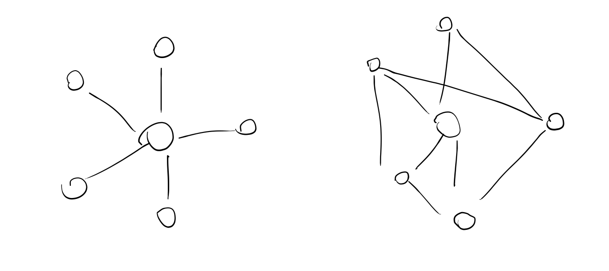

The way we organise is changing very rapidly. Perhaps it's just a case of being heavily tapped into the projects and writers who are talking about and making new ways of organising, but it feels like ideas that have floated around for decades, the failed and semi-failed experiments are have become forms that fit into our lives and will start to accelerate and actually change the way we live.

The broad shift I'm referring to is from centralised, one way power down through hierarchies to looser, less structured forms of organising that prioritise peer to peer communication and exchange.

r/wallstreetbets was the latest step in this direction. The occupy movement closed cities, but the Gamestop short squeeze appears to have caused a $70 billion loss for traders. Which one is making them listen? Key to both of these movements is that nobody ordered it - it could only happen via a group of people sharing their excitement about the power they could take together, encouraging each other and sharing that idea. Outside of riots - a temporary display of violence easily quashed by organised power - this doesn't happen. Or didn't happen.

Around 2010 the narrative around the possibilities of organising on the internet was filled with optimism. Clay Shirky's Here Comes Everybody is one I remember particularly. A manifesto for the new world, where we could come together at will based around the projects we thought were worthy, without anyone telling us what to do. I was excited.

Of course the entirely hopeful vision didn't come to pass and the narrative turned gloomy sometime after 2014. We read articles and listen to podcasts about the sinister power of Big Tech, being manipulated by algorithms, platforms' facilitation of hate speech and violent acts and the disconnection that comes from interacting on screens.

The reality is somewhere in between of course. If the needle was stuck on optimism before, we've swung the other way to pure doom. The key to this is recognising that the technology itself is not good or bad, it simply creates capability. Or in other words it gives people power. The word empowering sounds nice - it's generally presented in a lovely fluffy context. But the use of power is arbitrary, it allows for negative actions as much as it does positive.

Chunks of narrative making power that belonged to the traditional media are falling into the sea of online interaction and micro information transfers. From Wall Street Journal to wallstreetbets, from Fox News to Breitbart News, from the 6 o clock news presenting a single channel of information to gossip travelling around unmoderated WhatsApp groups.

With that dissipates the power and control that was once held by editors and owners of news outlets. That power and control isn't all bad. The reputation attached to the brand name requires fact checking. Narratives can be constructed whether conciously or simply through bias but there is also a consideration of the public interest.

_Happy little nodes in an almost fully connected network_

Decentralisation is often presented as something good and pure, with everyone being connected to everyone removing the need for any single party to be a conduit for information. The removal of the lynch pin node in the network prevents censorship. However simply because a network is capable of evolving to become fully connected, that is not necessarily or even likely the outcome.

Instead networks powered by platforms (at different levels, whether that's IP addressing or facebook messaging) where nodes can attach freely lead to all sorts of different constructions. Without intervention it seems like networks of people easily partition into separate groups. Information travels around the groups but very little comes in or out. When networks partition like this people outside the group of connected nodes become 2D characters. Straw men built to set on fire.

_Networks can split into as many parts that don't communicate as there are nodes_

There's a lot of talk about algorithms and the power they have over us. This is a very important topic when it comes to prejudice in automated decision making and how effectively automated decision making can replace human decisions. But the line is that "algorithms" powered by data we handed over allow tech companies to dominate our thoughts and feelings by combining that data with behavioural science. But you can do an experiment to see how much power they really hold over us. I've been on Amazon since about 2003. Probably thousands of purchases. I just read a book about Trump. Looking at my reccomendations I see 10 more books about Trump. The truth is that recommendation engines don't work that well. Netflix's autoplay is more powerful than a machine learning algorithm designed to figure out your intimate desires.

The focus on the threat from big tech's power is a distraction from the game changing under our feet. We can determine what kind of rules platforms should impose on their users and in what ways they should police content. But fairly soon those platforms are going to disappear and the role of a centralised node that has the capability to censor irrelevant. In the meantime decentralised social networks will have risen bringing a host of new problems to which old solutions don't apply.

If nothing can be censored or taken down, how do we combat misinformation? When narratives split into infinite dimensions with each online group having its own set of truths, how do we refind a collective understanding? What do we do when something great or something terrible happens but there is no power to pin it on just the hum of a hive mind engaged in collective action. This new game is evolving now and we need to understand it.

Just as representative democracy is a weird soap opera played by a handful of people so is organisation online. The future will be duked out by the knights and mooks of the internet. What would a leaderless political party look like? Headless brands is a good way to understand this - a movement with many touchpoints but without any central source of information, narrative making or responsibility. The people who understand this will do well because they are not trying to pull strings to make things happen but can spot the sea rising and ride the wave.

Power and it's abuse will not disappear in a decentralised world just as financial power does not disappear in a world where everyone is able to make and spend money because what you have access to is not the same as what you potentially have access to and some will be better at forming connections and becoming hubs. What is absolutely vital is recognising memes as an important form of communication. Yes, those images with captions, but that's just the expression of an idea being copied over and over, being passed around the network.

_Same nodes in the network. Just because it can end up like the right doesn't stop a single node from being the central power_

Let's not fall for the binary framing trap of the legacy old that has all the problems and the shiny new solution that solves all the problems. Old tools survived because they gave us something as well as because they gave people power. There's a genuine compromise between the public granting power and receiving something in return as with news media. New tools come with new problems that we need to learn how to deal with.

There's the technical elements of the decentralised world and the human elements. It would be foolish to ignore one of those in favour of the other. Both are key components. Without understanding how the new powers can be used we'll end up trusting in a naive vision. Without a sense of what those features are we'll be trying to build our understanding based on.
